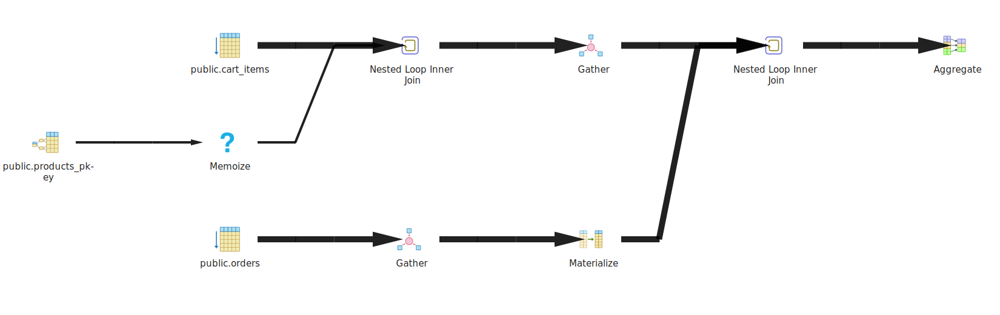
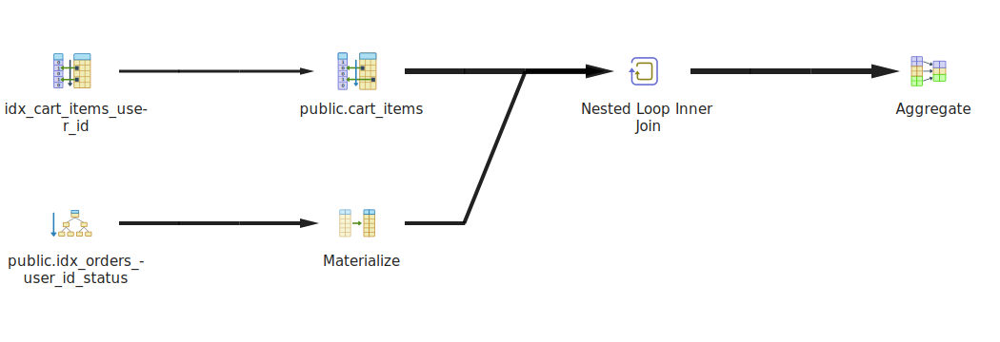

# Оптимизация SQL-запроса для вычисления суммарной стоимости товаров в корзине пользователя

## Описание задачи

Представьте, что у вас есть веб-приложение для онлайн-магазина, где пользователи могут просматривать товары, добавлять их в корзину и оформлять заказы. Ваша база данных содержит таблицы:

- **products** (товары)
- **orders** (заказы)
- **users** (пользователи)
- **cart_items** (товары в корзине)

Задача: улучшить производительность запроса, который вычисляет суммарную стоимость всех товаров, находящихся в корзине для конкретного пользователя.

### Исходный запрос

```sql
SELECT SUM(products.price * cart_items.quantity) AS total_cost
FROM products
JOIN cart_items ON products.id = cart_items.product_id
JOIN orders ON orders.user_id = cart_items.user_id
WHERE orders.status = 'active'
  AND orders.user_id = <user_id>;
```

### Проблемы исходного запроса

1. **Избыточные соединения**: в запросе используется ненужное соединение с таблицей `products`, что увеличивает нагрузку на систему.
2. **Медленная работа с большим количеством данных**: использование операций JOIN и отсутствие индексов на ключевых полях замедляет выполнение запроса.

### Оптимизированный запрос

Мы убрали избыточное соединение с таблицей `products` и улучшили структуру запроса:

```sql
SELECT SUM(ci.price * ci.quantity) AS total_cost
FROM cart_items AS ci
JOIN orders AS o ON o.user_id = ci.user_id
WHERE o.user_id = 1
  AND o.status = 'active';
```

### Изменения в запросе

1. Убрано соединение с таблицей `products`, так как данные о цене уже присутствуют в таблице `cart_items`.
2. Упростили запрос, что уменьшило количество операций JOIN, улучшив производительность.

### Создание индексов

Для улучшения производительности запроса были созданы следующие индексы:

```sql
CREATE INDEX idx_cart_items_user_id ON cart_items(user_id);
CREATE INDEX idx_orders_user_id_status ON orders(user_id, status);
CREATE INDEX idx_cart_items_product_id ON cart_items(product_id);
```

### Аналитика производительности

#### 1. До оптимизации запроса



Команда **EXPLAIN ANALYZE** без использования индексов:

```text
Aggregate  (cost=16936.54..16936.55 rows=1 width=32) (actual time=110.316..126.844 rows=1 loops=1)
Buffers: shared hit=6328 read=1274
->  Nested Loop  (cost=2000.43..16936.13 rows=54 width=10) (actual time=0.386..126.807 rows=72 loops=1)
      Buffers: shared hit=6328 read=1274
      ->  Gather  (cost=1000.43..11464.09 rows=18 width=14) (actual time=0.249..24.995 rows=18 loops=1)
            Workers Planned: 2
            Workers Launched: 2
            Buffers: shared hit=4504 read=1274
            ->  Nested Loop  (cost=0.43..10462.29 rows=8 width=14) (actual time=1.994..18.150 rows=6 loops=3)
                  Buffers: shared hit=4504 read=1274
                  ->  Parallel Seq Scan on cart_items  (cost=0.00..10431.50 rows=8 width=12) (actual time=1.967..18.074 rows=6 loops=3)
                        Filter: (user_id = 1)
                        Rows Removed by Filter: 299994
                        Buffers: shared hit=4470 read=1274
                  ->  Memoize  (cost=0.43..8.45 rows=1 width=10) (actual time=0.010..0.010 rows=1 loops=18)
                        Cache Key: cart_items.product_id
                        Cache Mode: logical
                        Hits: 3  Misses: 3  Evictions: 0  Overflows: 0  Memory Usage: 1kB
                        Buffers: shared hit=34
                  ->  Index Scan using products_pkey on products  (cost=0.42..8.44 rows=1 width=10) (actual time=0.015..0.015 rows=1 loops=8)
                        Index Cond: (id = cart_items.product_id)
                        Buffers: shared hit=34
```

#### 2. После оптимизации запроса



Команда **EXPLAIN ANALYZE** после создания индексов:

```text
Aggregate  (cost=83.34..83.35 rows=1 width=32) (actual time=0.368..0.369 rows=1 loops=1)
Buffers: shared hit=19 read=6
->  Nested Loop  (cost=4.99..82.93 rows=54 width=11) (actual time=0.304..0.345 rows=72 loops=1)
      Buffers: shared hit=19 read=6
      ->  Bitmap Heap Scan on cart_items ci  (cost=4.56..73.77 rows=18 width=15) (actual time=0.046..0.072 rows=18 loops=1)
            Recheck Cond: (user_id = 1)
            Heap Blocks: exact=18
            Buffers: shared hit=18 read=3
            ->  Bitmap Index Scan on idx_cart_items_user_id  (cost=0.00..4.56 rows=18 width=0) (actual time=0.040..0.040 rows=18 loops=1)
                  Index Cond: (user_id = 1)
                  Buffers: shared read=3
      ->  Materialize  (cost=0.42..8.50 rows=3 width=4) (actual time=0.014..0.015 rows=4 loops=18)
            Buffers: shared hit=1 read=3
            ->  Index Only Scan using idx_orders_user_id_status on orders o  (cost=0.42..8.48 rows=3 width=4) (actual time=0.251..0.253 rows=4 loops=1)
                  Index Cond: ((user_id = 1) AND (status = 'active'::text))
                  Heap Fetches: 0
                  Buffers: shared hit=1 read=3
```

### Выводы

1. **Использование индексов** значительно улучшило производительность запроса,<span style="color: red;"> снизив время его выполнения с **126.9 ms** до **0.41 ms**.</span>
2. **Оптимизация запроса** путем удаления лишних JOIN и упрощения логики, а также создание правильных индексов на ключевых полях, позволило ускорить работу с большими объемами данных.
3. **Представление**: для улучшения производительности можно рассмотреть создание представления, которое будет хранить предрассчитанные результаты, чтобы избежать выполнения сложных операций в реальном времени.

### Дальнейшие шаги

- **Представление**: создание представления, которое будет хранить результат запроса и обновляться по расписанию, позволит еще больше ускорить получение данных.
- **Кэширование**: в случае частых запросов с одинаковыми параметрами можно использовать кэширование результатов.